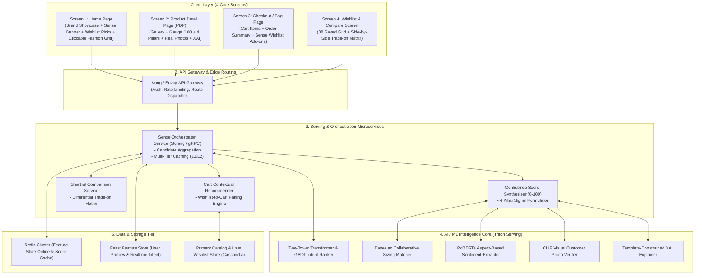
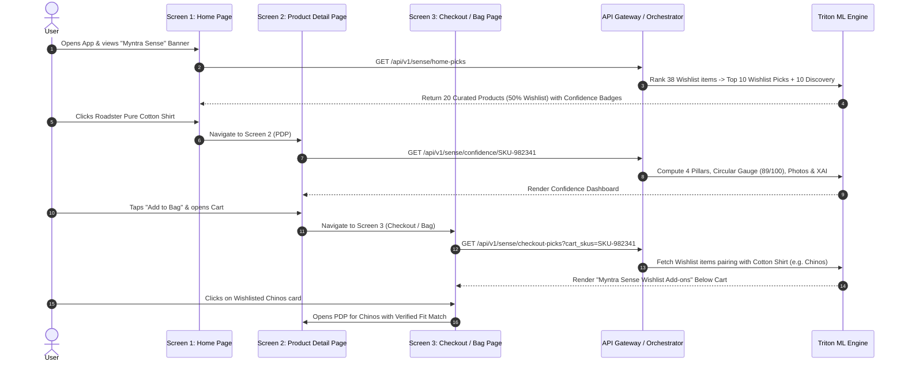

# 🏗️ Myntra Sense — System Architecture Document

---

## 1. Executive Architecture Summary

**Myntra Sense** is an AI-powered personalized confidence and intent-scoring engine designed to solve the wishlist-to-purchase conversion drop-off. It operates across **4 core user touchpoints**:
1. **Home Page Screen:** Showcases curated wishlist picks and trending products.
2. **Product Detail Page (PDP):** Delivers multi-dimensional confidence signals (Authenticity, Quality, Fit, Returns) and real customer photos.
3. **Checkout / Shopping Bag Screen:** Re-engages purchase intent by curating complementary high-confidence wishlist add-ons directly below cart items.
4. **Wishlist & Comparison Screen:** Provides side-by-side trade-off matrices to eliminate choice paralysis.

---

## 2. End-to-End Multi-Screen System Architecture



---

## 3. Screen Lifecycle & User Navigation Flow



---

## 4. API Endpoints & Contracts

### 4.1. Get Curated Home Picks
* **Endpoint:** `GET /api/v1/sense/home-picks?user_id={userId}`
* **Response (JSON):**
```json
{
  "status": "success",
  "data": {
    "sectionTitle": "Myntra Sense — Your Wishlist Picks",
    "rationale": "Curated from your 38 saved items based on your recent searches for summer casuals.",
    "totalWishlistCount": 38,
    "products": [
      {
        "productId": "SKU-982341",
        "title": "Roadster Men Pure Cotton Casual Shirt",
        "brand": "Roadster",
        "source": "WISHLIST",
        "confidenceScore": 89,
        "recommendedSize": "M",
        "fitConfidence": "96% Fit Match",
        "price": 1199,
        "highlights": ["100% Breathable Cotton", "Low Returns (< 4%)"]
      }
    ]
  }
}
```

---

### 4.2. Get Product Confidence Dashboard
* **Endpoint:** `GET /api/v1/sense/confidence/{productId}?user_id={userId}&size={size}`
* **Response (JSON):**
```json
{
  "status": "success",
  "data": {
    "productId": "SKU-982341",
    "overallConfidenceScore": 89,
    "confidenceTier": "HIGH_CONFIDENCE",
    "xaiExplanation": "Recommended for you because you recently searched for casual shirts, and this saved item has a 96% fit confidence with top-rated pure cotton fabric.",
    "signals": {
      "authenticity": { "score": 98, "badge": "100% Genuine Brand Assurance" },
      "quality": { "score": 91, "fabricRating": 4.7, "sentimentSummary": "89% praise fabric hand-feel." },
      "fitAndSizing": { "recommendedSize": "M", "fitMatchPercentage": 96, "sizeFeedback": "True to Size" },
      "returnConfidence": { "returnEaseScore": 95, "badge": "Hassle-Free 14-Day Doorstep Pickup" }
    },
    "customerPhotos": [
      { "url": "https://assets.myntassets.com/reviews/curated_pdp_1.jpg", "wearerSize": "Size M" }
    ]
  }
}
```

---

### 4.3. Get Checkout / Bag Wishlist Add-ons
* **Endpoint:** `GET /api/v1/sense/checkout-picks?user_id={userId}&cart_skus={skuList}`
* **Response (JSON):**
```json
{
  "status": "success",
  "data": {
    "sectionTitle": "Myntra Sense — Add from your Wishlist with High Confidence",
    "rationale": "High-confidence items from your 38 saved favorites that pair perfectly with items in your bag.",
    "products": [
      {
        "productId": "SKU-441092",
        "title": "Highlander Slim Fit Chinos",
        "brand": "Highlander",
        "confidenceScore": 86,
        "recommendedSize": "32",
        "fitConfidence": "Pairs with Cotton Shirt",
        "price": 999,
        "highlights": ["Stretch Comfort", "Verified Seller"]
      }
    ]
  }
}
```

---

### 4.4. Shortlist Comparison Service
* **Endpoint:** `POST /api/v1/sense/compare`
* **Response (JSON):** Side-by-side trade-off matrix with differential highlighting and winner badges.
