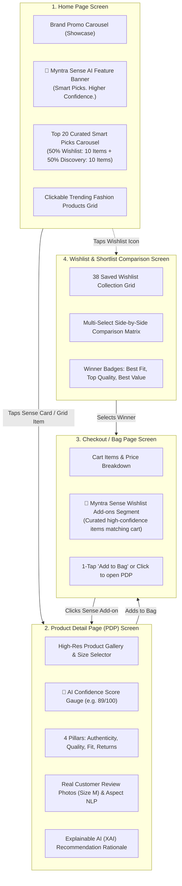

# 🧠 Myntra Sense — Product Context & Problem Statement

---

## 1. Overview & Strategic Context

* **Role:** Product Manager, Growth Team
* **Platform:** Myntra (Fashion & Lifestyle E-Commerce)
* **Initiative:** Myntra Sense — AI-Powered Personalized Confidence Engine
* **Objective:** Solve the Wishlist-to-Purchase conversion drop-off by eliminating psychological and informational hesitation through predictive AI and confidence signals, without relying on monetary incentives (no discounts, coupons, or flash sales).

---

## 2. Problem Statement

### The Core Problem
Millions of users browse fashion products on Myntra, discover items they love, and save them to their wishlists.
* **High Intent Signal:** Adding an item to a wishlist is an explicit declaration of intent, yet only a fraction converts into purchases within 30 days.
* **Wishlist Stagnation (20 to 50+ Saved Products):** Over time, users accumulate dozens—often 20, 50, or 100+—saved products. This accumulation creates choice overload and decision paralysis, transforming the wishlist into a static catalog graveyard.
* **Underlying Friction (Implicit Blockers):**
  - **Choice Overload:** Too many saved items with zero prioritization.
  - **Fit & Sizing Uncertainty:** Fear of ordering the wrong size and facing return friction.
  - **Quality & Authenticity Doubt:** Uncertainty about fabric feel, colorfastness, and real-life appearance.
  - **Lack of Decision Validation:** Absence of personalized validation confirming why an item is right to purchase now.

### Strategic Goal
> **Increase the percentage of users who purchase at least one item from their wishlist within 30 days of adding it.**

---

## 3. Solution: Myntra Sense Architecture & Multi-Touchpoint Journey

**Myntra Sense** is an AI confidence intelligence engine embedded across **4 core e-commerce screens**:

---

## 4. Detailed 4-Screen Functional Breakdown

### Screen 1: Home Page
* **Showcase Brand Carousel (Top):** Displays top fashion offers and brand spotlights (H&M, Mango, Nautica, Levi's, Taavi) for demo showcase.
* **Myntra Sense Hero Section:** High-impact AI card with official logo, *“Smart picks. Higher confidence.”*, key value pills (*20 Smart Picks Curated*, *50% from Wishlist*, *Better Fit Decisions*), and direct *“Tap to View”* CTA.
* **Curated Wishlist Picks Carousel:** 20 AI-curated products (**10 High-Intent Wishlist Picks** filtered from the user's 20–50+ saved items + **10 Complementary Discovery Picks**).
* **Clickable Fashion Products Grid:** Real fashion product cards (Ethnic wear, Casual shirts, Sportswear, Footwear) with genuine pricing, discounts, and 1-tap navigation to the PDP.

### Screen 2: Product Detail Page (PDP)
* **Fashion Gallery & Sizing:** Multi-angle image views and size selector (S, M, L, XL, XXL) with personalized fit indicators (*“96% Fit Match for Size M”*).
* **AI Confidence Dashboard:**
  - **Holistic Score:** e.g., **`89 / 100`** with color-coded gauge.
  - **4 Confidence Pillars:**
    1. 🛡️ **Authenticity Assurance:** 100% Genuine brand guarantee, seller tier validation.
    2. ⭐ **Quality Score:** Aspect-Based Sentiment Analysis (ABSA) on fabric hand-feel, color retention (400+ washes), and stitch durability.
    3. 📏 **Fit & Sizing Confidence:** Bayesian collaborative sizing predicting exact fit probability based on past order history.
    4. 🔄 **Return Confidence:** Low category return rate badge (< 4%) and 14-day doorstep pickup guarantee.
  - **Social & Visual Proof:** Real customer review photos worn by verified buyers in the user's size.
  - **Explainable AI (XAI) Copy:** Natural-language transparency explaining why this saved item was resurfaced.

### Screen 3: Checkout / Shopping Bag Page
* **Cart Summary:** List of active items in bag, size/quantity selectors, delivery address, and price details (Total MRP, Discount, Free Delivery).
* **Myntra Sense Wishlist Segment (Below Cart Items):**
  - Surfaces high-propensity wishlist items that pair with current cart items (e.g., if cart contains a Casual Shirt, Sense surfaces matching Chinos from the user's wishlist).
  - Each item displays its Confidence Score (`★ 89/100`), fit match chip, and quick *“Add to Bag”* button.
  - Clicking any product card opens its full PDP with confidence signals.

### Screen 4: Wishlist & Shortlist Comparison Screen
* **Saved Wishlist Grid:** Access all 38 saved items with real-time confidence scores and fit match tags.
* **Side-by-Side Comparison Matrix:** Compare up to 4 selected items across Price, Fit Match, Fabric Sentiment, Color Retention, Authenticity, and Returns.
* **Winner Highlighting:** Automatically badges `🎯 Best Fit Match`, `⭐ Highest Quality`, and `💡 Best Value`.

---

## 5. Success Metrics & Guardrails

* **Primary Metric:** 30-Day Wishlist-to-Purchase Conversion Rate ($\ge +18\%$ lift).
* **Secondary Metrics:**
  - Time-to-Purchase reduction ($\ge 35\%$ faster decision time).
  - Checkout-page Sense cross-sell conversion rate ($\ge 12\%$).
  - Shortlist comparison engagement and conversion rate.
* **Guardrail Metric:** Post-purchase 30-day return rate (must remain flat or decrease, validating confidence signal accuracy).
