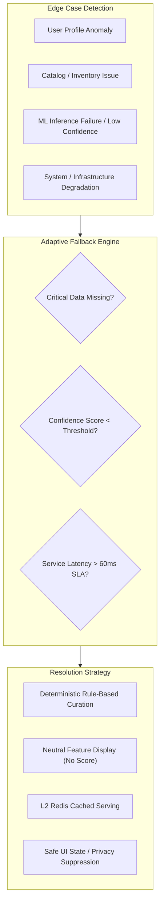
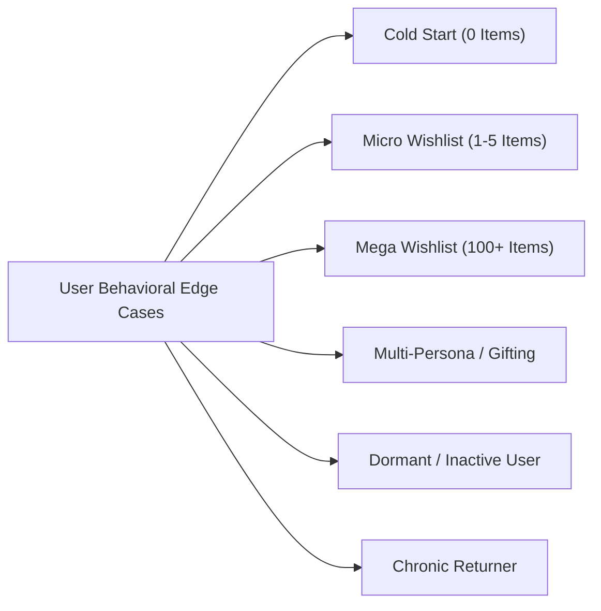
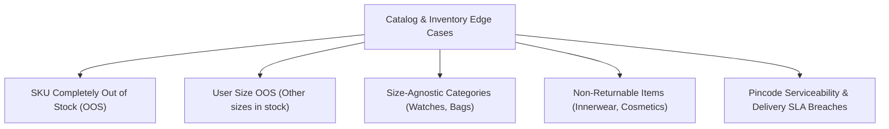
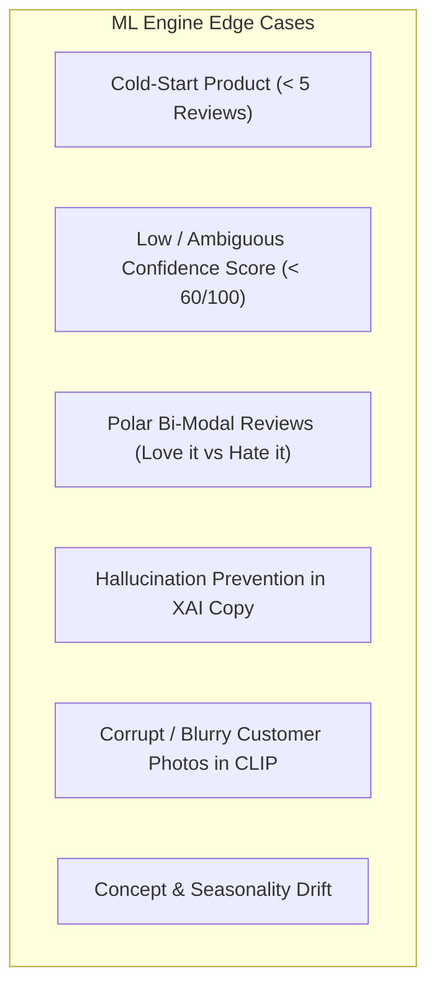
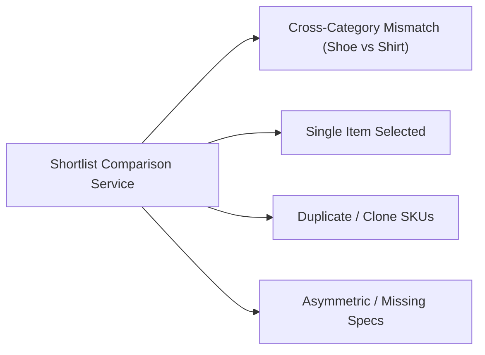
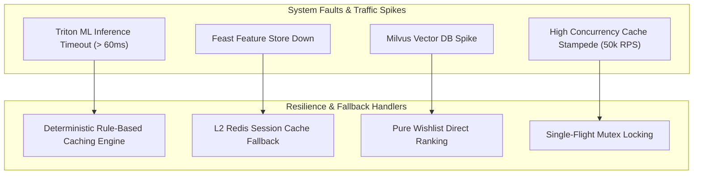
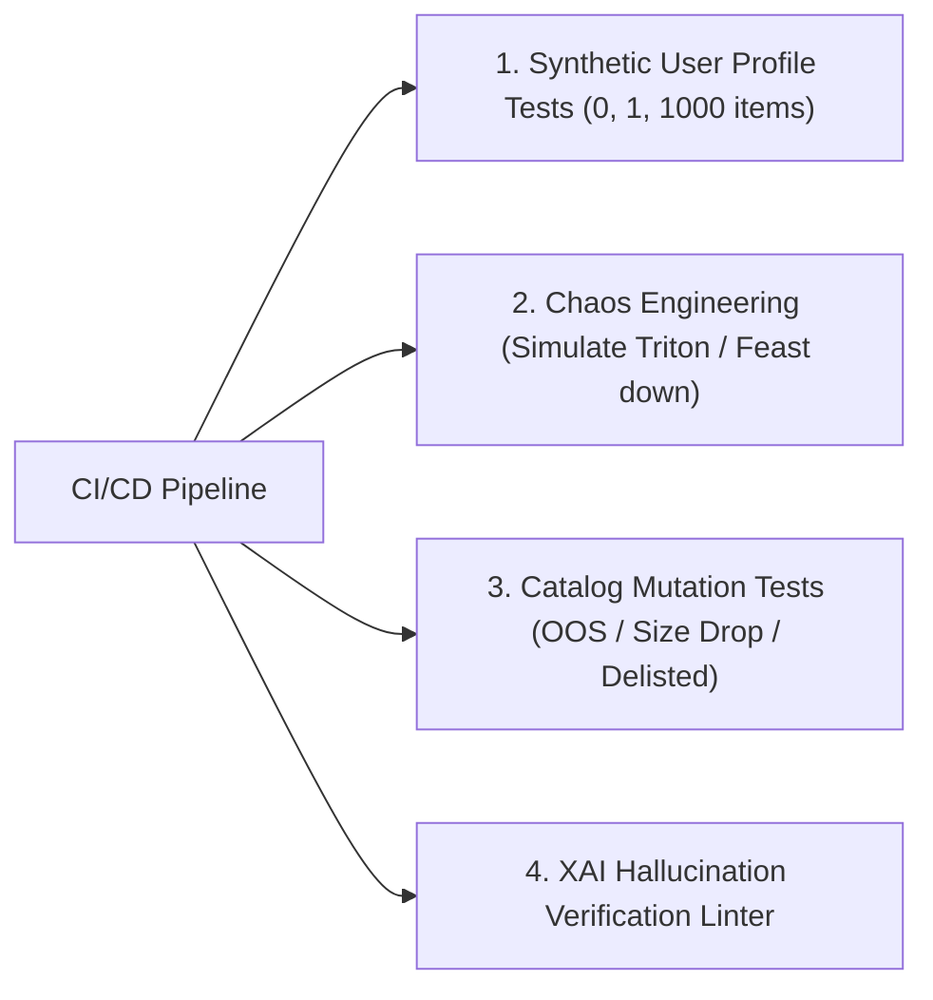

# 🛡️ Myntra Sense — Comprehensive Edge Cases & Fallback Specifications

---

## 1. Executive Overview & Guiding Philosophy

The **Myntra Sense** engine is designed to operate seamlessly across high-scale, dynamic e-commerce conditions (supporting $50,000+\text{ RPS}$ during peak sale events like End of Reason Sale). Because fashion e-commerce encompasses extreme catalog heterogeneity, volatile user behavior, and multi-layered machine learning pipelines, edge-case resilience is paramount.

### Core Architectural Principles for Edge Cases:
1. **Zero False Confidence:** Never display a fabricated, misleading, or low-probability confidence score. If AI signals cannot be validated with high certainty, degrade gracefully to neutral catalog facts.
2. **Graceful Functional Degradation:** Ensure that a failure in complex ML components (e.g., RoBERTa aspect mining, CLIP photo clustering) never blocks the core shopping funnel or degrades page load latency beyond SLAs ($< 60\text{ ms}$).
3. **Transparent Fallbacks:** When personalized data is unavailable, present clear contextual fallbacks (e.g., standard size charts, verified merchant badges) without confusing the user.
4. **Privacy & Sensitivity First:** Protect user dignity and privacy on shared devices by suppressing intimate/sensitive categories from prominent home-feed widgets.
5. **No Monetary Crutches:** Maintain the core business constraint—under no circumstance should an edge-case fallback resort to monetary discounts, price-drop triggers, or coupon incentives.



---

## 2. User Profile & Behavioral Edge Cases



---

### UC-01: Zero Wishlist Items (Absolute Cold Start)
* **Trigger Condition:** User opens the Myntra app with 0 items saved in their wishlist (`wishlist_count == 0`).
* **Technical Impact:** Candidate generation pool for the 6 wishlist picks is empty.
* **Fallback & Resolution Strategy:**
  1. **Home Feed Suppression / Mode Shift:** Suppress the *"Myntra Sense — Your Wishlist Picks"* module entirely or replace it with *"Myntra Sense — Personalized Category Starter"*.
  2. **Top Discovery Curation:** Populate 10 items purely from contextual trending items and recent category browsing affinity (if available) or top-rated platform bestsellers.
  3. **Wishlist Onboarding CTA:** Display an interactive tooltip on the PDP: *"Tap the ❤️ icon on items you love to unlock Myntra Sense AI Confidence scores."*
* **UI Representation:** Seamless transition without empty placeholders or broken carousel blocks.

---

### UC-02: Micro Wishlist (1 to 5 Wishlist Items)
* **Trigger Condition:** User has between 1 and 5 items in their wishlist (`1 <= wishlist_count < 6`), which is fewer than the 6 wishlist picks required for the Top 10 Home Feed module.
* **Technical Impact:** Insufficient candidate volume for the standard 6:4 Wishlist-to-Discovery ratio.
* **Fallback & Resolution Strategy:**
  1. **Dynamic Ratio Adjustment:** Include all $N$ valid in-stock wishlist items ($N \in [1, 5]$).
  2. **Complementary Item Expansion:** Dynamically scale complementary discovery items to fill the remaining $(10 - N)$ slots.
  3. **Contextual Tagging:** Clearly badge the wishlist items with *"From Your Wishlist"* and discovery items with *"Pairs Well With Your Saved [Category]"*.
* **UI Representation:** The Home Feed carousel renders a full 10-item list with explicit badge demarcation.

---

### UC-03: Mega Wishlist (100 to 1,000+ Wishlist Items)
* **Trigger Condition:** Power users with hundreds or thousands of accumulated wishlist items over several years.
* **Technical Impact:** High computational complexity in candidate ranking; potential latency spikes during scoring.
* **Fallback & Resolution Strategy:**
  1. **Pre-Filtering Pipeline (Stage 1 Hard Filter):**
     - Immediate SQL/NoSQL indexed filter to discard items marked as Out of Stock (OOS) or Inactive.
     - Prune items with no user engagement in the last 180 days unless they match active 7-day search keywords.
  2. **Top-K Vector Index Search:** Use Milvus/Pinecone approximate nearest neighbor (ANN) search against the user's active session embedding to extract the top 50 candidates, passing only those 50 into the heavy GBDT ranker.
  3. **Execution Guardrail:** Hard timeout at $30\text{ ms}$ for candidate retrieval; if exceeded, fallback to the top 20 most recently saved in-stock items.

---

### UC-04: Dormant / Inactive User (No Activity in > 90 Days)
* **Trigger Condition:** User opens the app after 90+ days of dormancy. No real-time clickstream, search queries, or active session embeddings exist in Feast/Flink.
* **Technical Impact:** Real-time intent vector $\vec{E}_{\text{search}}$ is zero or stale.
* **Fallback & Resolution Strategy:**
  1. **Long-Term Preference Anchoring:** Fall back to historic static profile features (favorite brands, historical size profile, primary gender preference).
  2. **Seasonal Context Injection:** Boost wishlist items matching the current season/weather (e.g., if re-engaging in November, rank saved jackets/sweaters higher than summer shorts).
  3. **Re-engagement Copy:** Update XAI rationale: *"Welcome back! We've highlighted top-rated favorites from your saved collection."*

---

### UC-05: Brand New User (Zero Historical Purchases or Sizes)
* **Trigger Condition:** Freshly registered user saves items to their wishlist, but has never placed an order on Myntra (no return profile, no confirmed body measurements).
* **Technical Impact:** Personalized Bayesian Fit Model cannot compute a personalized fit score.
* **Fallback & Resolution Strategy:**
  1. **Wisdom of the Crowd Fallback:** Display aggregate community sizing feedback rather than personalized fit scores (e.g., *"True to Size — 89% of 1,200 buyers report standard fit"* instead of *"96% Fit Match for you"*).
  2. **Interactive Size Guesser:** Display a lightweight 1-tap size recommendation modal (asking Height & Standard Brand size).
  3. **Confidence Score Normalization:** Re-weight the overall Confidence Score to exclude the personalized fit penalty, normalizing across Authenticity (35%), Quality (35%), and Return Ease (30%).

---

### UC-06: Multi-Persona / Gifting Contamination
* **Trigger Condition:** A male user wishlists women's dresses (for a partner) or kids' footwear, causing conflicting sizing signals and category confusion.
* **Technical Impact:** Sizing predictor attempts to match a Men's Size L profile against a Women's Size S dress, generating erroneous fit warnings.
* **Fallback & Resolution Strategy:**
  1. **Category Gender Segmentation:** Partition the user's wishlist into distinct gender/category buckets.
  2. **Persona Detection:** If a wishlisted item belongs to a non-primary profile category (e.g., Women's Ethnic on a Men's account), isolate it from personal sizing models.
  3. **UI Demarcation:** Display standard size charts with a prompt: *"Shopping for someone else? Select their size to check community fit insights."*

---

### UC-07: High Return-Risk / Chronic Returner Profile
* **Trigger Condition:** User has a historical return rate $> 60\%$ driven by frequent sizing mismatch or impulsive buying.
* **Technical Impact:** High business cost if low-fit items are recommended.
* **Fallback & Resolution Strategy:**
  1. **Stricter Fit Thresholds:** Elevate the minimum Fit Confidence threshold from $80\%$ to $92\%$ before displaying high-confidence endorsements.
  2. **Explicit Size & Fabric Warnings:** Highlight specific customer review callouts regarding sizing variance (e.g., *"Runs 1 size small — most buyers recommend sizing up"*).
  3. **Return Friction Transparency:** Clearly communicate return terms without punitive messaging (e.g., *"14-day hassle-free doorstep exchange available"*).

---

## 3. Catalog, Product & Inventory Edge Cases



---

### CI-01: Completely Out of Stock (OOS) / Discontinued SKU
* **Trigger Condition:** A wishlisted product is completely out of stock across all sizes or has been delisted by the seller.
* **Technical Impact:** Recommending an unpurchasable item causes severe user frustration.
* **Fallback & Resolution Strategy:**
  1. **Hard Filtering:** The Sense Orchestrator service filters out OOS items before intent scoring.
  2. **Smart In-Stock Substitute (Similar Style Engine):** If a high-intent wishlisted item is OOS, generate a high-confidence alternative from the same brand/style with available stock.
  3. **UI Presentation in Wishlist:** In the standard Wishlist view, display a subtle *"Similar Available Picks with 90%+ Confidence"* CTA.

---

### CI-02: User-Specific Size OOS (Product In-Stock for Other Sizes)
* **Trigger Condition:** A wishlisted shirt is in stock for XS, S, and XL, but the user's predicted size **M** is sold out.
* **Technical Impact:** Directing the user to the PDP results in immediate drop-off when they see their size missing.
* **Fallback & Resolution Strategy:**
  1. **Home Feed Rank Demotion:** Demote the item from the Top 6 high-intent picks unless the user has actively searched for that exact SKU in the last 15 minutes.
  2. **PDP Sizing Availability Alert:** If the user opens the PDP, display: *"Size M is currently unavailable. Would you like a notification when restocked or view top similar picks in Size M?"*
  3. **Suppression of "Add to Bag" Quick CTA:** Disable the 1-tap quick buy action for that SKU on feed cards.

---

### CI-03: Size-Agnostic / Non-Apparel Categories (Bags, Watches, Perfumes, Sunglasses)
* **Trigger Condition:** The wishlisted product does not have apparel sizing dimensions.
* **Technical Impact:** The **Fit & Sizing Confidence Pillar** is structurally not applicable.
* **Fallback & Resolution Strategy:**
  1. **Dynamic Pillar Re-weighting:** Dynamically swap the Fit pillar with category-specific confidence pillars:
     - **Watches & Electronics:** *Warranty & Brand Official Service Network*.
     - **Fragrances & Cosmetics:** *Long-Lasting Scent / Skin Compatibility Index*.
     - **Bags & Luggage:** *Capacity, Water Resistance & Compartment Durability*.
  2. **Normalized 100-Point Score:** Re-balance the confidence score formula:
     $$\text{Score}_{\text{Agnostic}} = 0.40 \times \text{Authenticity} + 0.40 \times \text{Quality} + 0.20 \times \text{ReturnEase}$$
  3. **UI Widget Adaptation:** Replace the circular size fit gauge with a *"Dimension & Specs Accuracy"* badge.

---

### CI-04: Non-Returnable / Final Sale Categories (Innerwear, Cosmetics, Pierced Jewelry)
* **Trigger Condition:** Items marked non-returnable due to hygiene or policy constraints.
* **Technical Impact:** Displaying *"Hassle-Free Return Confidence"* is legally incorrect and misleading.
* **Fallback & Resolution Strategy:**
  1. **Policy-Compliant Confidence Signal:** Suppress the Return Confidence badge.
  2. **Replacement with Hygiene & Seal Assurance:** Replace with *"100% Sealed & Authentic Guarantee — Non-returnable for hygiene"*.
  3. **Extra Emphasis on Sizing Accuracy:** Prioritize detailed measurement charts and customer fit sentiment to prevent pre-purchase errors.

---

### CI-05: Pincode Serviceability & Delivery SLA Breaches (> 7 Days)
* **Trigger Condition:** Product is in stock, but cannot be delivered to user's saved pincode, or estimated delivery time exceeds 7 days.
* **Technical Impact:** High abandonment at final checkout step.
* **Fallback & Resolution Strategy:**
  1. **Geo-Location Inventory Filtering:** Check warehouse inventory allocation against user's primary delivery pincode before ranking.
  2. **SLA Thresholding:** Exclude items with estimated delivery $> 5\text{ days}$ from the prominent Home Feed picks, prioritizing fast-dispatch items.
  3. **Transparency Notice:** If viewed on PDP, display explicit delivery timeline: *"Expected Delivery: 6–8 days to [Pincode]"*.

---

### CI-06: Checkout Screen Wishlist Deduplication & Pairing (Screen 3)
* **Trigger Condition:** User already has SKU-982341 (Roadster Shirt) in their Bag. The Myntra Sense Checkout add-on segment attempts to surface SKU-982341 from the user's wishlist.
* **Technical Impact:** Redundant and confusing recommendation in the cart.
* **Fallback & Resolution Strategy:**
  1. **Cart SKU Exclusion Filter:** The `/checkout-picks` service queries active cart items and strictly filters out any SKU currently in the bag.
  2. **Complementary Category Pairing Engine:** Surfaces wishlisted items from complementary categories (e.g. Trousers, Shoes, Belts) that pair with items currently in the cart.
  3. **1-Tap Add to Bag or PDP Drill-Down:** Clicking *"Add to Bag"* immediately updates cart totals without page reload; clicking the card opens its full PDP with confidence signals.

---

## 4. AI/ML & Confidence Engine Edge Cases



---

### ML-01: Cold-Start Product (Zero or Sparse Reviews / Ratings)
* **Trigger Condition:** Newly launched SKU with $< 5$ customer reviews and $< 10$ ratings.
* **Technical Impact:** NLP Aspect-Based Sentiment Analysis (RoBERTa) cannot extract meaningful sentiment stats; risk of noisy predictions.
* **Fallback & Resolution Strategy:**
  1. **Brand & Category Level Aggregation:** Inherit verified quality baseline scores from the parent brand and sub-category (e.g., *“Brand Trust Score: 4.6/5 across 20k+ Roadster items”*).
  2. **Visual & Material Spec Matching:** Use manufacturer-verified material specifications (e.g., 100% combed cotton, 180 GSM).
  3. **Confidence Score Suppression:** Do NOT show an overall numerical score (e.g., 87/100). Instead, show: *"Brand Verified — Fresh Style with Official Manufacturer Guarantee"*.

---

### ML-02: Low / Borderline Confidence Score ($< 60 / 100$)
* **Trigger Condition:** Product has high return rates, inconsistent sizing feedback, or low quality ratings resulting in a score $< 60/100$.
* **Technical Impact:** Displaying a low score (e.g., "Confidence: 42/100") on a wishlisted item actively damages user trust and creates negative sentiment.
* **Fallback & Resolution Strategy:**
  1. **Home Feed Exclusion:** Automatically exclude items with confidence $< 70/100$ from the "Myntra Sense" curated picks.
  2. **PDP Honest Guidance Mode:** On the PDP, suppress the top-level green confidence badge. Instead, render objective decision insights highlighting specific considerations:
     - *"Customer Note: 42% of buyers mention the fabric is sheer; consider wearing an inner layer."*
     - *"Fit Note: Runs smaller than average; we recommend ordering one size up."*
  3. **No Artificial Inflation:** Never artificially boost scores to maintain platform integrity.

---

### ML-03: Polar Bi-Modal Review Distribution (Conflicting Sentiment)
* **Trigger Condition:** Product has hundreds of 5-star reviews praising the look, but also numerous 1-star reviews criticizing fabric shrinkage after washing.
* **Technical Impact:** Average rating (3.2/5) masks the true underlying nuance.
* **Fallback & Resolution Strategy:**
  1. **Aspect-Level Deconstruction:** Separate distinct attributes in the NLP pipeline:
     - *Aesthetics & Design:* **94% Positive**
     - *Post-Wash Longevity:* **58% Critical (Shrinkage reported)**
  2. **Balanced AI Synthesis in UI:** Display both pros and key care tips:
     - ✅ *"High praise for design, drape, and color richness."*
     - ⚠️ *"Care tip: Cold wash recommended to prevent shrinkage."*

---

### ML-04: Hallucination & Fabrication Prevention in XAI Copy
* **Trigger Condition:** LLM generating explainable copy invents false attributes (e.g., claiming a synthetic jacket is *"100% Genuine Leather"*).
* **Technical Impact:** Legal liability, customer dissatisfaction, and consumer protection violations.
* **Fallback & Resolution Strategy:**
  1. **Template-Guided Generation with Strict Slot-Filling:** Prohibit unconstrained generative LLM calls. Enforce strict JSON schema templates:
     ```json
     {
       "template_id": "XAI_SEARCH_AND_FIT_MATCH",
       "variables": {
         "search_term": "Linen Shirts",
         "fit_score": 96,
         "material_feature": "100% Breathable Linen"
       }
     }
     ```
  2. **Rule-Based Slot Validator:** Pre-verify that `material_feature` matches verified catalog metadata before rendering the string.
  3. **Sanitization Filter:** Regex and keyword blacklist filtering to prevent hallucinated claims.

---

### ML-05: Low-Quality / Inappropriate Customer Review Photos
* **Trigger Condition:** User-uploaded review photos contain poor lighting, packaging boxes, distorted angles, or inappropriate content.
* **Technical Impact:** Diminishes visual appeal on the PDP confidence card.
* **Fallback & Resolution Strategy:**
  1. **CLIP Embedding Filtering:** Reject images with low clarity embeddings or high cosine similarity to packaging/box clusters.
  2. **Safety & Moderation Pipeline:** Pass images through NSFW and moderation models with zero tolerance.
  3. **Human Curated / High-Vote Fallback:** Prioritize photos with $> 10$ customer "Helpful" upvotes.
  4. **Fallback State:** If no high-quality customer photos pass the filter, display studio model photos with real-world fabric close-ups.

---

### ML-06: Concept & Seasonality Drift
* **Trigger Condition:** High-intent wishlisted item is a heavy wool trench coat, but the current date is May in Delhi ($43^\circ\text{C}$).
* **Technical Impact:** Recommending thermal wear during heatwaves damages relevance perception.
* **Fallback & Resolution Strategy:**
  1. **Weather & Geolocation Context Layer:** Flink stream decorates user requests with local temperature and climate zone.
  2. **Seasonal Penalty Multiplier:** Apply a time-decay and seasonal relevance multiplier $\gamma_{\text{season}}$ to the intent formula:
     $$\text{IntentScore} = \gamma_{\text{season}} \times \text{BaseIntentScore}$$
     Where $\gamma_{\text{season}} = 0.2$ for off-season apparel unless active search explicitly queries off-season items.

---

## 5. Shortlist Comparison Engine Edge Cases



---

### CP-01: Cross-Category Incomparable Products
* **Trigger Condition:** User selects a pair of sneakers and a polo shirt from their wishlist to compare.
* **Technical Impact:** Attribute comparison matrix fails due to orthogonal taxonomy (e.g., Sole Material vs Collar Type).
* **Fallback & Resolution Strategy:**
  1. **Taxonomy Compatibility Gate:** Ensure comparison is only enabled for items within the same `L2/L3` category hierarchy (e.g., Men's Casual Shirts vs Men's Formal Shirts).
  2. **UI Prevention & Smart Grouping:** Automatically group wishlist items by category in the comparison selector: *"Select up to 3 Casual Shirts to compare"*.
  3. **Helpful Error Modal:** If triggered via deep link: *"We can only compare similar items. Select another shirt to compare with this item."*

---

### CP-02: Single-Item Comparison Trigger
* **Trigger Condition:** User taps "Compare" on a product, but has no other similar items saved in their wishlist.
* **Technical Impact:** Cannot render a side-by-side matrix with 1 item.
* **Fallback & Resolution Strategy:**
  1. **AI Auto-Partner Pairing:** Automatically fetch the top 2 highest-confidence complementary or alternative catalog items in the same subcategory.
  2. **Header Labeling:** Label the user's item as *"Your Saved Item"* and the AI picks as *"Top Similar Alternatives with High Confidence"*.

---

### CP-03: Duplicate / Near-Identical SKUs
* **Trigger Condition:** User has saved the exact same shirt in two different colors or from two different marketplace sellers.
* **Technical Impact:** Comparison matrix displays $99\%$ redundant identical data.
* **Fallback & Resolution Strategy:**
  1. **Differential Highlighting Mode:** Collapse identical rows (Fabric, Fit Type, Brand) and prominently highlight the only varying factors: *Colorway, Seller Rating, Immediate Stock Availability, Delivery Speed*.

---

### CP-04: Asymmetric / Missing Attribute Data
* **Trigger Condition:** Item A has full technical specs (100% Supima Cotton, 220 GSM, Bio-washed), while Item B from a smaller brand only lists "Cotton Blend".
* **Technical Impact:** Ugly "N/A" cells in the comparison table.
* **Fallback & Resolution Strategy:**
  1. **Normalized Attribute Mapping:** Map detailed specs into common consumer categories: *Fabric Purity, Thickness/Feel, Stretchability*.
  2. **Graceful Placeholder:** Display *"Standard Cotton Blend (Details provided by brand)"* instead of blank/null values.

---

## 6. System Resilience & Distributed Edge Cases



---

### SYS-01: ML Inference Engine (Triton) Latency Spike / Crash ($> 60\text{ ms}$)
* **Trigger Condition:** GPU node failure or extreme traffic surge causing model inference latency to breach the $60\text{ ms}$ P95 SLA.
* **Fallback Strategy:**
  1. **Circuit Breaker Trip (Resilience4j / Golang Hystrix):** After 5 consecutive requests exceeding $60\text{ ms}$, open the circuit breaker for 30 seconds.
  2. **Rule-Based Heuristic Fallback:** Rank wishlist items by:
     $$\text{Score}_{\text{Fallback}} = 0.5 \times \text{ProductRating} + 0.3 \times \text{RecentInteractions} + 0.2 \times \text{InStockStatus}$$
  3. **Static Confidence Badges:** Display pre-computed daily batch confidence badges from Redis cache.

---

### SYS-02: Feast Online Feature Store Outage
* **Trigger Condition:** Feast Redis / Bigtable online feature store becomes unreachable.
* **Fallback Strategy:**
  1. **L2 Local Memory & Edge Cache:** Read user size preferences and recent search tokens stored in the encrypted JWT session token or L2 Redis cluster.
  2. **Non-Personalized Serving:** If user profile is unavailable, serve global category confidence baselines.
  3. **Zero Impact on Funnel:** Page renders without interruption; log alert to PagerDuty/Datadog.

---

### SYS-03: Real-Time Stream Processor (Kafka / Flink) Backpressure
* **Trigger Condition:** Kafka consumer lag increases during peak events; real-time search intent events take $> 30\text{ seconds}$ to process.
* **Fallback Strategy:**
  1. **Session-Level Local Fallback:** The mobile app passes the last 3 search query strings directly in the API request header (`X-Recent-Search-Tokens`).
  2. **Lightweight Edge Matching:** Sense Orchestrator performs direct keyword string matching against wishlist titles while Flink recovers.

---

### SYS-04: High Concurrency Cache Stampede (50,000+ RPS EORS Traffic)
* **Trigger Condition:** Cache TTL expires on top-selling wishlisted items during nationwide flash sales, causing thousands of simultaneous requests to hammer the backend database.
* **Fallback Strategy:**
  1. **Single-Flight / Mutex Locking (Golang `sync.Singleflight`):** Ensure only 1 worker query executes downstream feature extraction and model inference for a given SKU, while other concurrent callers await the shared result.
  2. **Probabilistic Early Expiration (XFetch Algorithm):** Recompute cache asynchronously before hard TTL expiration:
     $$\Delta t - \beta \cdot \delta \cdot \ln(\text{rand}()) < 0$$
  3. **Layered L1 In-Memory Caching:** Keep hot product confidence badges in local Go application memory ($5\text{ MB}$ footprint, $60\text{ s}$ TTL).

---

## 7. Privacy, Compliance & Ethical Edge Cases

---

### PRV-01: Sensitive Category Privacy (Intimates, Lingerie, Shared Devices)
* **Trigger Condition:** User wishlists lingerie, innerwear, shapewear, or personal wellness items on a phone frequently used by family members.
* **Technical Impact:** Prominently surfacing these items on the Home Page widget creates embarrassment or privacy breaches.
* **Fallback & Resolution Strategy:**
  1. **Sensitive Category Tagging:** Tag specific taxonomy IDs (`intimates`, `lingerie`, `sleepwear`, `personal_care`) as `SENSITIVE_CATEGORY`.
  2. **Home Feed Exclusion:** Automatically exclude sensitive categories from the main Home Page *"Myntra Sense — Your Wishlist Picks"* carousel.
  3. **Confined to PDP & Wishlist:** Confidence scores remain accessible inside the private Wishlist tab and on direct PDP views.

---

### PRV-02: DPDP Act (India) / Right to be Forgotten Compliance
* **Trigger Condition:** User requests account data deletion or revokes tracking consent under India's Digital Personal Data Protection (DPDP) Act.
* **Technical Impact:** System must purge user purchase history, sizing models, and return profiling data.
* **Fallback & Resolution Strategy:**
  1. **Async Data Purge Job:** Kafka event `user_data_erasure` triggers deletion across Feast Online Store, Redis cache, and offline data lake tables.
  2. **Default Anonymous Profile:** Immediately convert user's Sense session to anonymous guest mode (Wisdom-of-the-Crowd confidence signals only).

---

### PRV-03: Algorithmic Fairness & Seller Monopolization Guardrails
* **Trigger Condition:** ML model disproportionately favors mega-brands due to review volume, unfairly penalizing high-quality emerging D2C brands.
* **Fallback & Resolution Strategy:**
  1. **Bayesian Shrinkage on Quality Scores:** Regularize aspect scores so emerging brands with 20 reviews (all 5-star) are not penalized compared to 10,000-review brands, while preventing unverified inflation.
  2. **Seller Diversity Constraint:** Enforce a maximum cap of 2 items from the same brand/seller in the Top 10 Home Feed recommendations.

---

## 8. Master Edge Case Matrix & Fallback Runbook

| Edge Case ID | Category | Trigger Condition | Severity | System Fallback Action | UI Representation | Monitoring Alert / Metric |
| :--- | :--- | :--- | :---: | :--- | :--- | :--- |
| **UC-01** | User | 0 Wishlist Items | Medium | Suppress module; show Category Starter | Seamless alternative carousel | `sense_cold_start_users_total` |
| **UC-02** | User | 1–5 Wishlist Items | Low | Include all $N$ wishlist + $(10-N)$ discovery | Distinct *"From Wishlist"* badges | `sense_micro_wishlist_served` |
| **UC-03** | User | 100+ Wishlist Items | High | ANN vector pre-filtering to top 50 | Fast rendering within 50ms | `sense_mega_wishlist_latency_ms` |
| **UC-04** | User | Dormant User (>90d) | Low | Seasonal + brand profile fallback | *"Welcome back!"* curated copy | `sense_dormant_user_reactivations` |
| **UC-05** | User | New User (0 Orders) | Medium | Aggregate crowd sizing (No personal fit score) | *"89% true to size (Community)"* | `sense_zero_history_inferences` |
| **UC-06** | User | Cross-Gender Gifting | Medium | Category isolation; suppress personal fit | *"Shopping for someone else?"* | `sense_persona_mismatch_detected` |
| **UC-07** | User | High Returner (>60%) | High | Fit score threshold raised to 92% | Strict sizing warnings & notes | `sense_high_return_risk_served` |
| **CI-01** | Catalog | SKU Completely OOS | High | Filter out; fetch in-stock substitute | Filtered out or *"Similar in Stock"* | `sense_oos_items_filtered` |
| **CI-02** | Catalog | User Size M is OOS | High | Demote rank; disable 1-tap quick buy | Alert: *"Size M out of stock"* | `sense_size_oos_demotions` |
| **CI-03** | Catalog | Non-Apparel (Watches/Bags) | Low | Re-weight score to Authenticity + Quality | *"Specs & Warranty Verified"* | `sense_size_agnostic_invocations` |
| **CI-04** | Catalog | Non-Returnable Items | Medium | Suppress Return badge; show Hygiene seal | *"Sealed & Genuine Assurance"* | `sense_non_returnable_handled` |
| **CI-05** | Catalog | Pincode Delivery >7d | Medium | Demote in feed; show exact delivery date | Clear delivery ETA on PDP | `sense_delivery_sla_breached` |
| **ML-01** | AI/ML | Cold Product (<5 reviews) | Medium | Brand baseline + suppress numeric score | *"Brand Verified Style"* | `sense_sparse_review_skus` |
| **ML-02** | AI/ML | Low Score (<60/100) | High | Exclude from feed; honest PDP guidance | Objective advice (e.g. size up) | `sense_low_confidence_suppressed` |
| **ML-03** | AI/ML | Polar Bi-Modal Reviews | Medium | Deconstruct ABSA into separate pros/tips | Distinct Pros & Care Tips | `sense_bimodal_sentiment_split` |
| **ML-04** | AI/ML | XAI Hallucination Risk | Critical | Slot-filling schema template validation | Verified factual copy only | `sense_xai_template_violations` |
| **ML-05** | AI/ML | Blurry/Corrupt Photos | Low | CLIP embedding clarity filter fallback | Studio real-world fabric closeups | `sense_clip_photo_rejections` |
| **ML-06** | AI/ML | Seasonality Concept Drift | Medium | Apply temperature & seasonal penalty $\gamma$ | Weather-aligned picks only | `sense_seasonality_penalties` |
| **CP-01** | Compare | Incomparable Categories | Low | Restrict compare to same L2/L3 category | Helpful category guidance modal | `sense_compare_mismatch_blocked` |
| **CP-02** | Compare | 1 Item Compare Trigger | Low | Auto-fetch top 2 high-confidence peers | *"Top Similar Alternatives"* | `sense_compare_single_item_auto` |
| **CP-03** | Compare | Near-Identical SKUs | Low | Differential view (collapse identicals) | Highlight varying specs only | `sense_compare_diff_mode_active` |
| **SYS-01** | System | Triton Inference Timeout | Critical | Circuit breaker trip to Redis rule ranker | Pre-computed static badges | `sense_triton_circuit_breaker_tripped` |
| **SYS-02** | System | Feast Feature Store Down | High | Read L2 Redis session cache | Global category baseline | `sense_feast_fallback_invoked` |
| **SYS-03** | System | Flink Stream Lag >30s | Medium | App passes search tokens in header | Near-real-time keyword match | `sense_flink_lag_seconds` |
| **SYS-04** | System | Cache Stampede (50k RPS) | Critical | SingleFlight mutex + XFetch algorithm | Sub-40ms cached delivery | `sense_singleflight_locks_active` |
| **PRV-01** | Privacy | Sensitive Lingerie Category | High | Exclude from Home Feed carousel | Private Wishlist/PDP view only | `sense_sensitive_items_masked` |
| **PRV-02** | Privacy | DPDP Data Purge Request | High | Purge Redis/Feast; switch to Guest mode | Anonymous baseline signals | `sense_dpdp_purges_completed` |
| **PRV-03** | Ethics | Emerging Brand Bias | Medium | Bayesian shrinkage + 2 SKU/brand cap | Fair representation in feed | `sense_diversity_caps_applied` |

---

## 9. Verification & Automated Edge Case Testing Suite

To ensure continuous resilience against edge cases, the following automated test suites are integrated into the CI/CD pipeline:



### Automated Verification Scenarios:
1. **Zero & Micro Wishlist Ingestion Test:** Validate that users with 0 to 5 wishlist items receive a valid 10-item feed with zero HTTP 500 errors and correct badge distribution.
2. **Chaos Mesh Injection:** Inject $100\text{ ms}$ artificial network latency into Triton GPU inference and verify automatic circuit breaker tripping to rule-based fallback within 3 requests.
3. **Out-of-Stock Filter Accuracy:** Simulate 50% SKU inventory drop in Cassandra and verify that 0% of OOS items appear in `/api/v1/sense/home-picks`.
4. **XAI Copy Sanitization Assertions:** Run 10,000 synthetic slot-filled strings against catalog attributes to assert zero hallucinated material compositions.
5. **Sensitive Category Leakage Assertions:** Query the home picks endpoint across 5,000 synthetic intimates-heavy profiles to verify 100% suppression of sensitive category IDs from the public feed.
