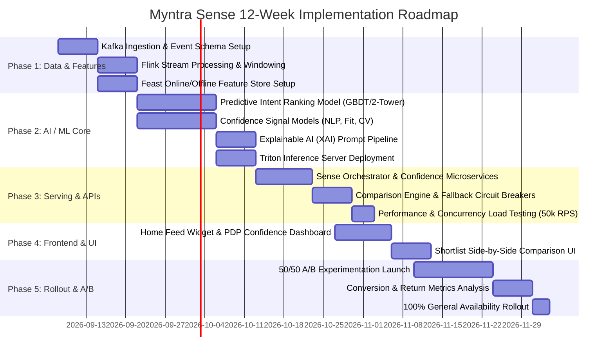

# 🚀 Myntra Sense — Phase-Wise Implementation Plan

---

## 1. Overview & Roadmap Summary

This document defines the production implementation plan for **Myntra Sense (AI-Powered Personalized Confidence Engine)** based on [context.md](file:///c:/Users/user/Desktop/Myntra%20Sense/context.md) and [architecture.md](file:///c:/Users/user/Desktop/Myntra%20Sense/architecture.md).

The initiative is partitioned into **5 sequential phases** spanning a total of **12 weeks**, delivering high-concurrency real-time streaming, predictive ML models, resilient microservices, rich mobile/web UI, and safe A/B experimentation.

---

## 2. Detailed Phase Breakdown

---

### 🟢 Phase 1: Real-Time Ingestion, Telemetry & Feature Store (Weeks 1–2)
**Goal:** Establish low-latency event ingestion and real-time feature computation for user intent and catalog confidence signals.

#### Key Deliverables:
1. **Kafka Event Topics & Schema Registry:**
   - Define Protobuf/Avro schemas for `search_events`, `pdp_views`, `wishlist_ops`, and `clickstream_events`.
   - Implement event producers across Mobile App (iOS/Android) and Web gateways.
2. **Apache Flink Stream Processing:**
   - Build stateful 15-minute sliding session windows to track user search terms, category dwell time, and recent intent shifts.
   - Aggregate intent triggers to invalidate stale cache entries in Redis.
3. **Feast Feature Store Deployment:**
   - **Online Store (Redis / Bigtable):** Low-latency retrieval ($< 5\text{ ms}$) for user size history, return propensity, and brand affinity.
   - **Offline Store (Snowflake / S3):** Historical training dataset generation linking past wishlist additions to 30-day purchase conversion.

#### Verification & Exit Criteria:
* Event publishing latency $< 100\text{ ms}$; Flink stream latency $< 1.5\text{ s}$.
* Online feature store p99 read latency $< 5\text{ ms}$ under simulated 20,000 RPS.

---

### 🔵 Phase 2: AI / ML Models & Confidence Signal Engine (Weeks 3–5)
**Goal:** Train, validate, and deploy the machine learning models responsible for intent ranking, multi-dimensional confidence scoring, and natural-language rationales.

#### Key Deliverables:
1. **Wishlist Intent Prioritization Model:**
   - Train a **Two-Tower Embedding + GBDT Ranker** to calculate $P(\text{Buy}_{30d} \mid \text{User}, \text{Wishlist Item}, \text{Context})$.
   - Filter 20–50+ saved items down to the Top 6 highest-intent candidates.
2. **Confidence Signal Analyzers:**
   - **Fit & Size Matcher:** Bayesian collaborative sizing model trained on customer height/weight/past order data to predict exact size match probability.
   - **Quality NLP Engine:** Fine-tune RoBERTa/MiniLM for Aspect-Based Sentiment Analysis (ABSA) on reviews (fabric, durability, color, stitching).
   - **Authenticity & Return Assurance Scorer:** Rule-backed ML model scoring seller trust and category return friction.
   - **Visual Verifier (CLIP):** Photo clustering pipeline to select high-quality, verified customer review images.
3. **Explainable AI (XAI) Generation:**
   - Template-constrained LLM service to output concise, hallucination-free explanations (e.g., *"Recommended based on your recent searches for cotton shirts and 96% fit match"*).
4. **Model Serving on Triton / TorchServe:**
   - Quantization (FP16 / INT8) for sub-25ms inference latency.

#### Verification & Exit Criteria:
* Intent model achieves $\ge 0.78$ AUC-ROC on offline holdout dataset.
* Model inference P95 latency $< 25\text{ ms}$ on NVIDIA GPU / optimized CPU instances.

---

### 🟡 Phase 3: Backend Serving Orchestration & APIs (Weeks 6–7)
**Goal:** Develop resilient, high-throughput microservices to aggregate AI scores, handle caching, and serve client requests under strict SLAs.

#### Key Deliverables:
1. **Sense Orchestrator Service (Golang / gRPC):**
   - Candidate generation, parallel gRPC calls to feature stores and ML inference clusters.
   - Multi-tier caching strategy (L1 In-Memory + L2 Redis Cluster).
2. **Core API Endpoints:**
   - `GET /api/v1/sense/home-picks`: Returns Top 10 curated picks (6 Wishlist + 4 Complementary).
   - `GET /api/v1/sense/confidence/{productId}`: Returns holistic 0–100 Confidence Score and 4 pillar signals.
   - `POST /api/v1/sense/compare`: Computes side-by-side trade-off matrix for selected wishlist items.
3. **Resilience & Circuit Breakers:**
   - Implement Netflix Hystrix / Resilience4j style fallbacks:
     - Fallback to catalog rating ranker if ML latency $> 60\text{ ms}$.
     - Fallback to pre-computed daily batch sentiment if NLP service is degraded.
4. **Performance & Stress Testing:**
   - Conduct load testing up to 50,000 RPS using k6/Locust.

#### Verification & Exit Criteria:
* P95 API response time $< 60\text{ ms}$ for `/home-picks` and $< 40\text{ ms}$ for `/confidence/{productId}`.
* 100% graceful fallback execution during simulated inference outages.

---

### 🟣 Phase 4: UI/UX & Client Integration (Weeks 8–9)
**Goal:** Build and integrate rich, animated, responsive client components across iOS, Android, and Web platforms.

#### Key Deliverables:
1. **Home Feed Widget — *“Myntra Sense — Your Wishlist Picks”*:**
   - Carousel showing top high-intent wishlist items + complementary discovery picks.
   - Dynamic badges highlighting high confidence (e.g., *"96% Fit Match"*, *"Authentic Guarantee"*).
2. **PDP Confidence Dashboard:**
   - Circular Confidence Gauge (Score /100).
   - 4 Interactive Signal Accordions (🛡️ Authenticity, ⭐ Quality, 📏 Fit, 🔄 Return Confidence).
   - Curated real customer photos gallery.
   - Explainable AI rationale card.
3. **Wishlist Shortlist Comparison Modal:**
   - Side-by-side comparative table highlighting differences in fit, fabric ratings, and price-to-confidence value.
4. **Client-Side Telemetry & Analytics:**
   - Instrument impression, click, hover, and conversion events.

#### Verification & Exit Criteria:
* Zero frame drops on 60 FPS mobile devices.
* UI accessibility compliance (WCAG 2.1 AA) across all screen sizes.

---

### 🔴 Phase 5: A/B Testing, Optimization & Scale (Weeks 10–12)
**Goal:** Execute a controlled A/B experiment, evaluate conversion lift and return rate guardrails, and achieve 100% rollout.

#### Key Deliverables:
1. **A/B Experimentation Setup:**
   - **Control Group (50%):** Standard chronological Wishlist view + standard PDP.
   - **Variant Group (50%):** Myntra Sense Home Widget + PDP Confidence Dashboard + Comparison Matrix.
2. **Metric Monitoring & Guardrails:**
   - **Primary Metric:** 30-Day Wishlist-to-Purchase Conversion Rate ($\ge +15\text{--}20\%$ target lift).
   - **Guardrail Metric 1:** Post-purchase return rate (must remain flat or decrease).
   - **Guardrail Metric 2:** Home feed latency & crash rates.
3. **Phased Production Rollout:**
   - Day 1–3: 5% Canary rollout.
   - Day 4–7: 25% rollout.
   - Day 8–14: 50% A/B test run.
   - Day 15+: 100% General Availability upon statistical significance ($p < 0.01$).

#### Verification & Exit Criteria:
* Statistically significant lift in 30-day conversion rate without increasing return rates.
* System stable at $50,000+\text{ RPS}$ with 99.99% availability.

---

## 3. Team Allocation & Responsibilities

| Role | Core Responsibilities | Headcount |
| :--- | :--- | :--- |
| **Data / Platform Engineer** | Kafka pipelines, Flink streaming, Feast feature store | 2 |
| **ML / AI Engineer** | Intent ranking models, ABSA NLP, Sizing predictor, Triton deployment | 3 |
| **Backend Engineer** | Golang serving orchestrator, Redis caching, gRPC APIs, load testing | 2 |
| **Mobile / Frontend Engineer**| React Native / iOS / Android UI, PDP widgets, Comparison modal | 3 |
| **Product Manager & QA** | Experimentation design, telemetry validation, UX sign-off | 2 |

---

## 4. Risk Matrix & Mitigation Strategies

| Risk | Impact | Probability | Mitigation Strategy |
| :--- | :---: | :---: | :--- |
| **Cold Start for New Wishlisted Items** | High | Medium | Use category-level average confidence scores and visual similarity embeddings as baseline. |
| **ML Inference Latency Spikes during Peak Traffic** | High | Low | Multi-tier Redis caching + instant fallback to static rule-based ranker on $>60\text{ms}$ latency. |
| **Incorrect Size Predictions Causing Returns** | High | Low | Conservative confidence thresholds; only show $>90\%$ fit match badge; otherwise show standard size guide. |
| **Hallucination in AI Explanation Text** | Medium | Low | Use template-constrained copy generation with slot-filling instead of unconstrained text generation. |
